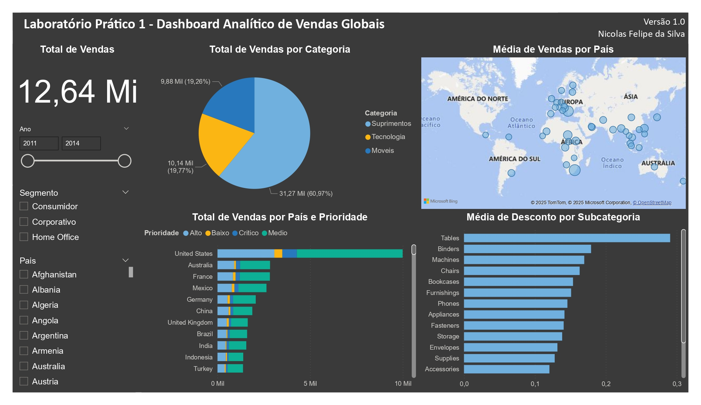
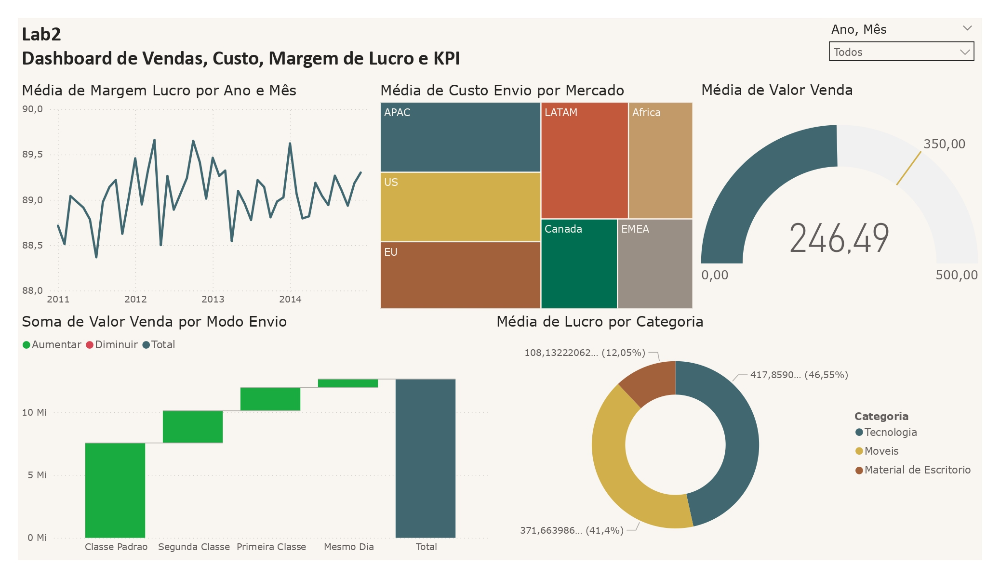
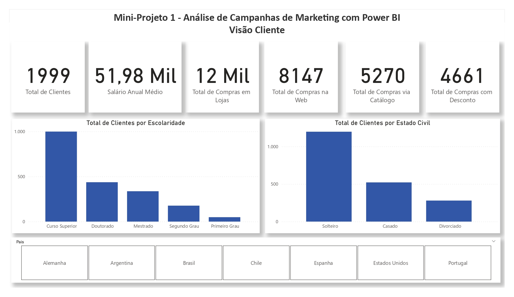
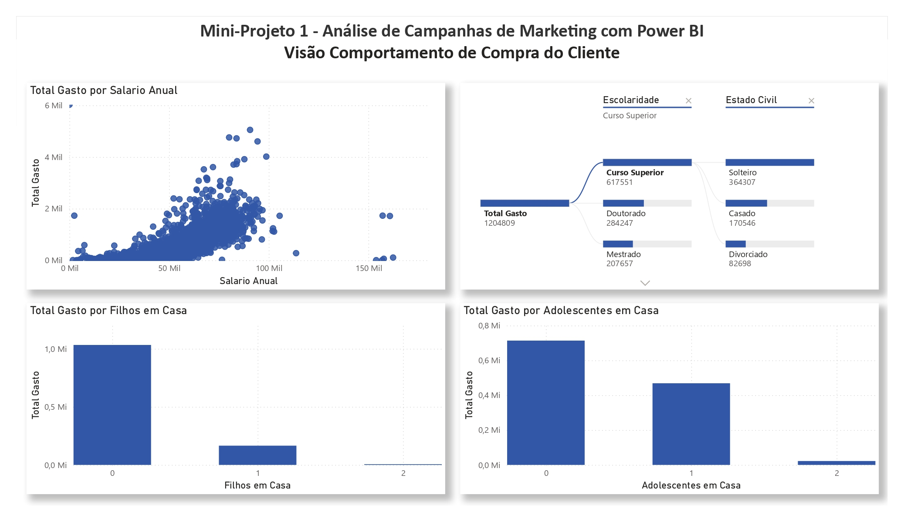
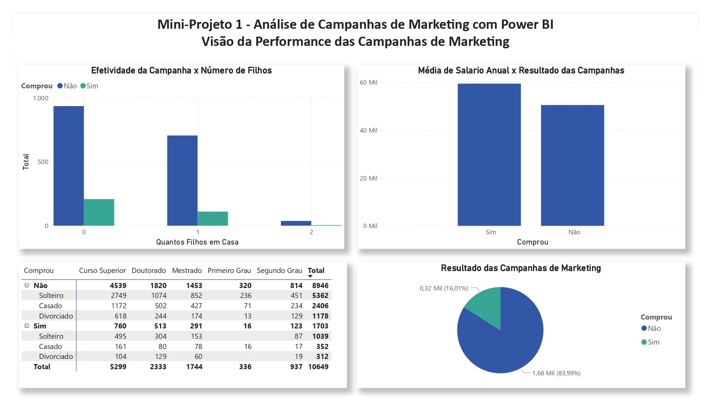
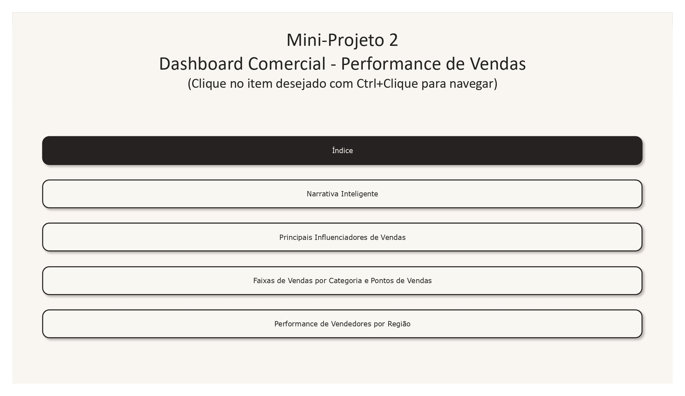
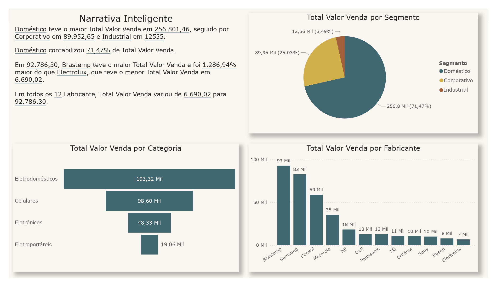
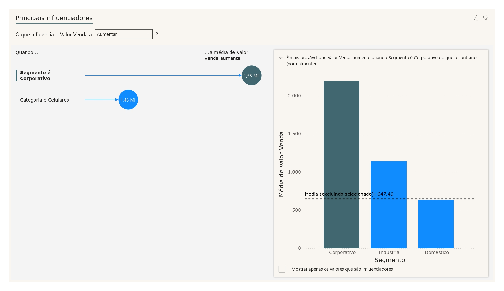
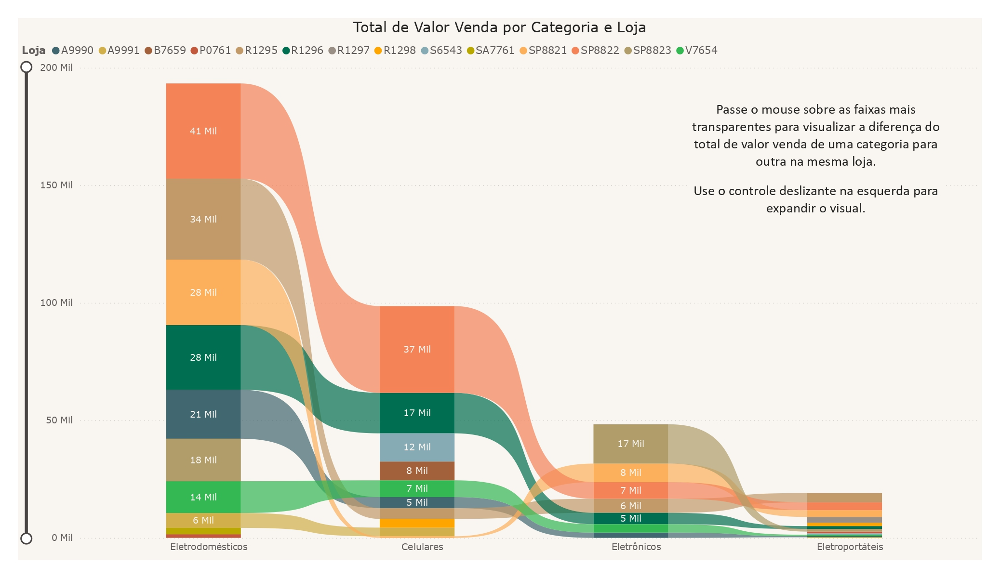
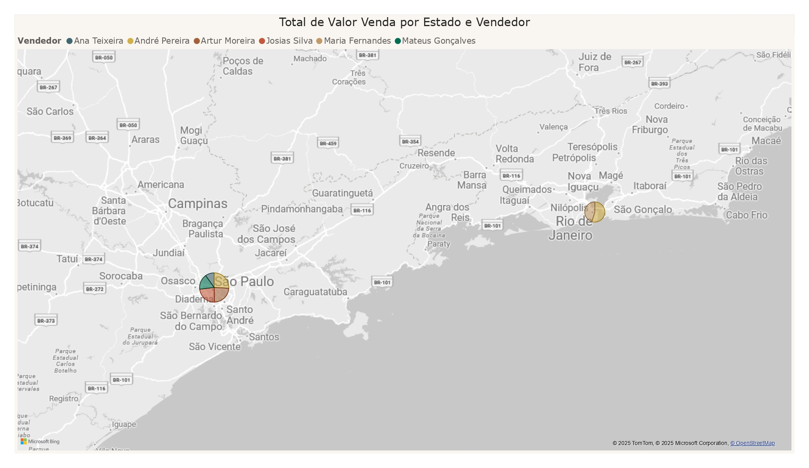

# Repositório criado para guardar e mostrar o conteúdo que estou estudando no curso da Data Science Academy de PowerBI.

## Dashboard do Capítulo 2:
- Pergunta 1 - Qual o valor total vendido?
- Pergunta 2 - Quantas vendas foram realizadas por categoria de produto?
- Pergunta 3 - Quantas vendas foram realizadas por país considerando a prioridade de entrega?
- Pergunta 4 - Qual foi a média de desconto nas vendas por subcategoria de produto?
- Pergunta 5 - Quais países tiveram maior média de valor de venda? Demonstre em um mapa.

## Dashboard do Capítulo 3:
- Pergunta 1 - Qual foi o total de valor venda considerando cada modo de envio dos pedidos? Use um gráfico de cascata.
- Pergunta 2 - Quais mercados tiveram o maior custo médio de envio dos produtos vendidos? Use um gráfico treemap.-
- Pergunta 3 - A empresa tem como objetivo (meta) manter uma média de 350 para o valor de venda todos os meses. Mostre um indicador (KPI–Key Performance Indicator) com o valor médio de venda. A empresa ficou abaixo ou acima da meta no mês de Abril/2014?
- Pergunta 4 - Considere que o lucro é equivalente a:valor venda -custo envio. Qual categoria de produto apresentou maior lucro médio.
- Pergunta 5 - Qual foi o comportamento da margem de lucro ao longo do tempo? Considere amargem de lucro como o lucro dividido pelo valor venda.

- 
## Dashboard do Capítulo 4:
- 
- 
- 
## Dashboard do Capítulo 5:
- 
- 
- 
- 
- 
